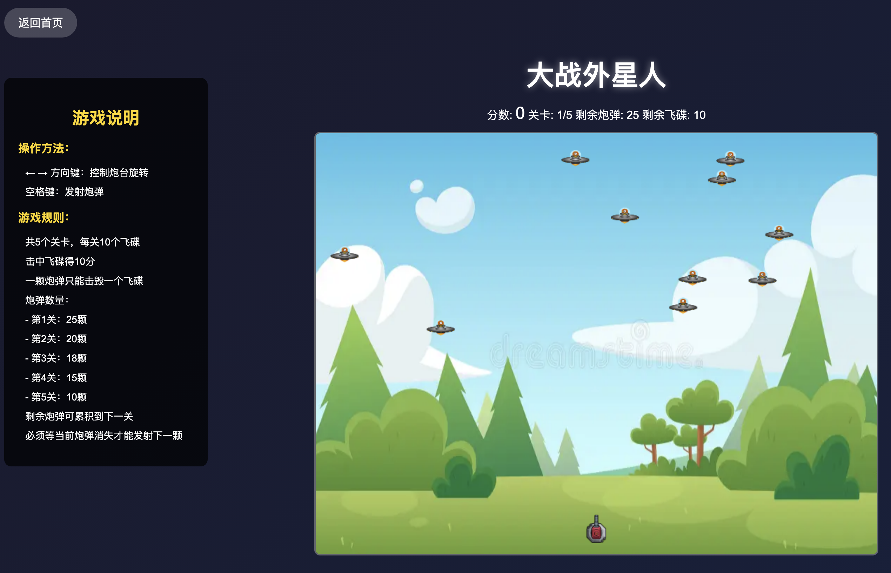
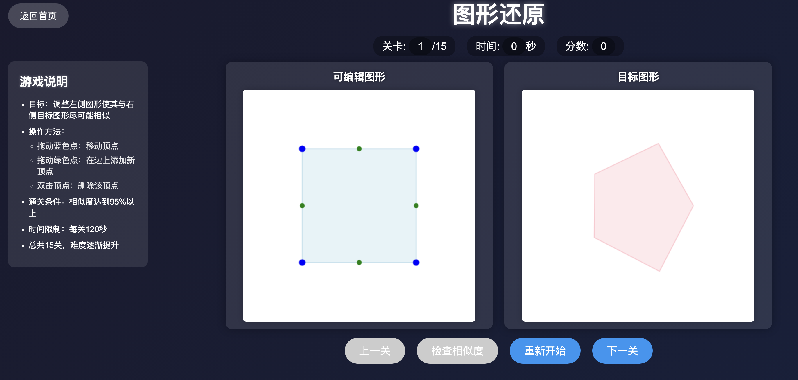
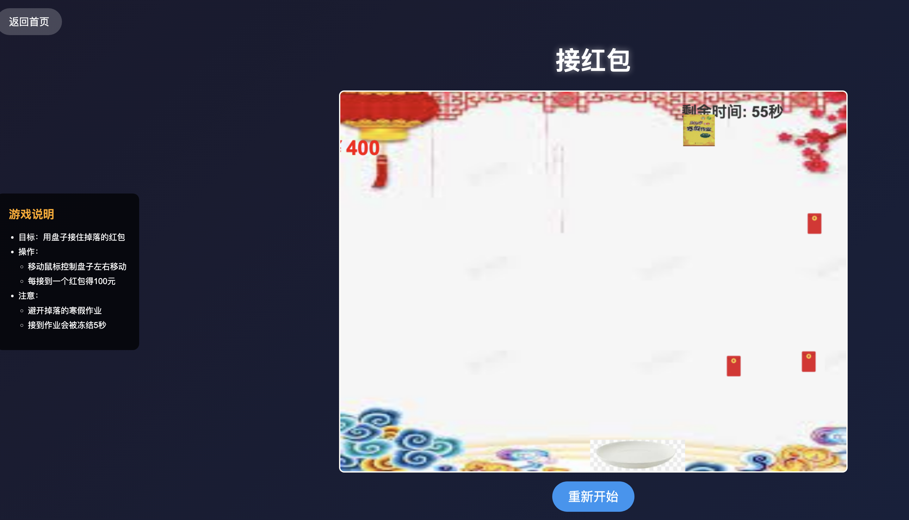

 娃：爸爸，整天听你说AI，AI到底能做什么呀？
 我：AI可以做很多事情。
 娃：那AI能做游戏吗？
 我：能呀，你想做什么游戏？
 娃：我想做一个大战外星人的游戏。
 我：可以呀，你想想游戏规则是什么？就让我们开始吧。
 
 ......
 接下来就是通过cursor，全程不用手动写代码一步步的实现这个游戏。
 ......
 娃：还挺好玩的，我还能增加几关吗？
 我：可以呀，你告诉cursor你的想法就行.
 ......
 <!-- 插入图片 -->
 
 
 娃：我又想到一个游戏，对比图形的游戏。。。。。。
 我：可以
 ......
 <!-- 插入图片 -->
 
 娃：这个游戏太难了，我想做一个接红包的游戏。。。。。。
 我：可以，这次你来做吧，你告诉cursor你的想法就行。
 娃：我试试。。。。。。
 ......
 <!-- 插入图片 -->
 
 
 总结：
 娃娃提出想法和需求，我负责教娃娃用cursor实现，零代码，零基础，零门槛，最有一个接红包的游戏由娃娃独立完成。
